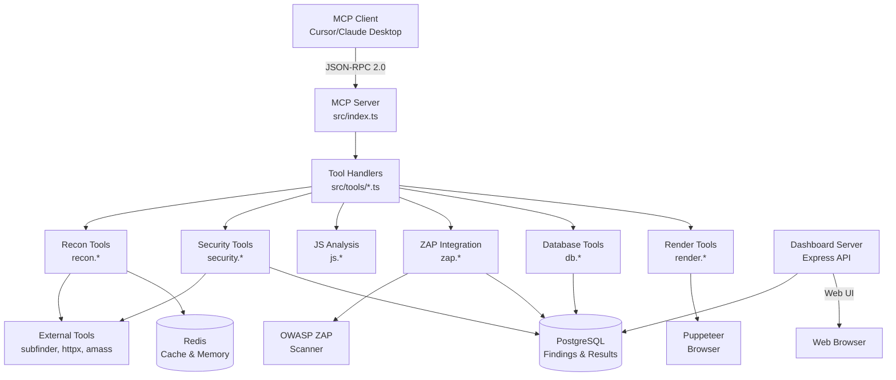
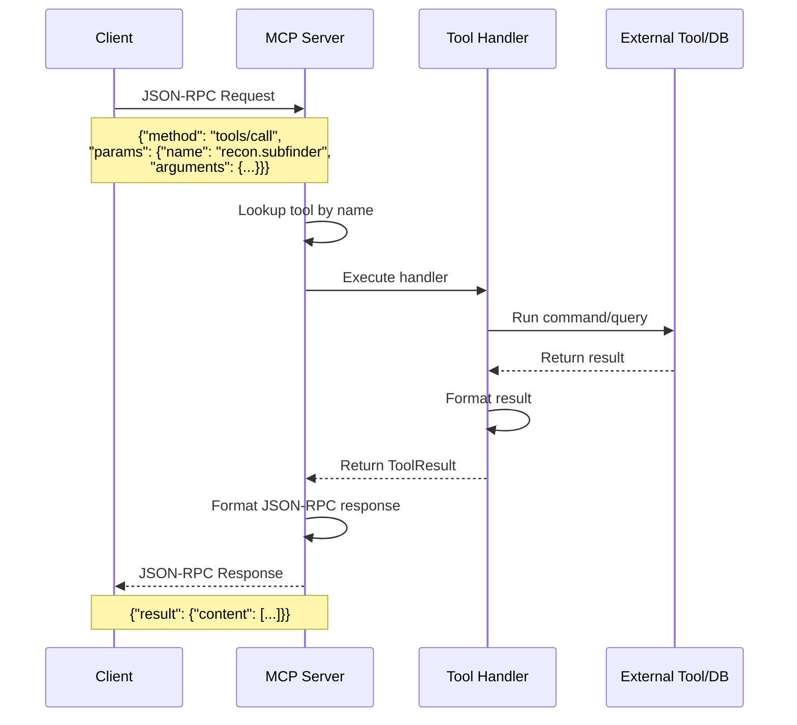
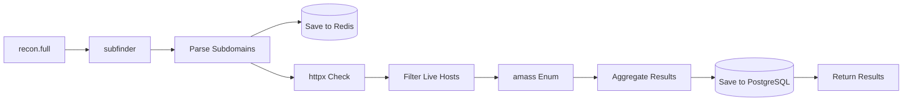
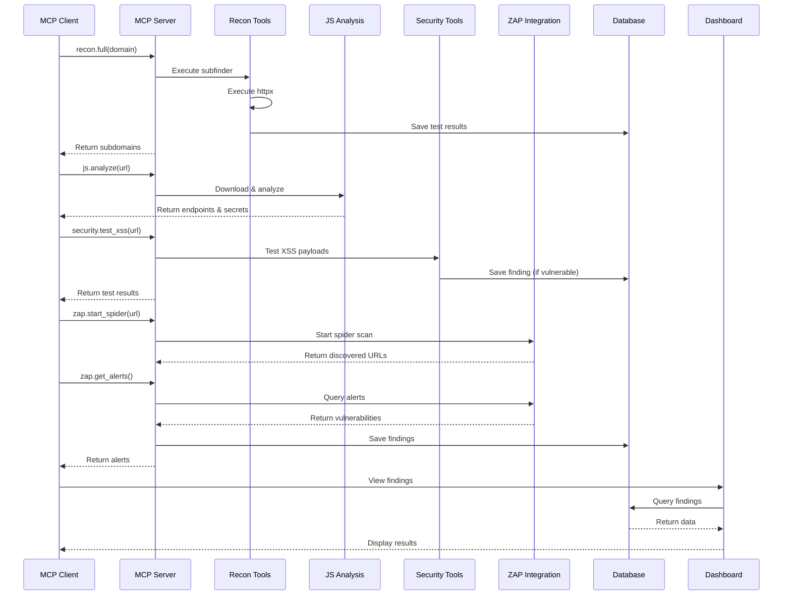

# VulneraMCP Workflow Documentation

## Overview

VulneraMCP is an AI-powered bug bounty hunting platform that operates as a Model Context Protocol (MCP) server. It provides security testing tools, reconnaissance capabilities, and vulnerability detection through an MCP-compatible interface.

## Architecture Flow

### Visual Architecture Diagram



### System Components

```
┌─────────────────┐
│  MCP Client     │  (Cursor, Claude Desktop, etc.)
│  (AI Assistant) │
└────────┬────────┘
         │ JSON-RPC 2.0
         │ (stdin/stdout)
         ▼
┌─────────────────┐
│  MCP Server     │  (src/index.ts)
│  (Main Entry)   │
└────────┬────────┘
         │
         ├──► Tool Registration
         │    ├── recon.*
         │    ├── security.*
         │    ├── js.*
         │    ├── zap.*
         │    ├── db.*
         │    └── ...
         │
         ▼
┌─────────────────┐
│  Tool Handler   │  (src/tools/*.ts)
│  (Execution)    │
└────────┬────────┘
         │
         ├──► External Tools
         │    ├── subfinder, httpx, amass
         │    ├── OWASP ZAP
         │    └── Puppeteer (rendering)
         │
         ├──► Database
         │    ├── PostgreSQL (findings, results)
         │    └── Redis (caching, working memory)
         │
         └──► Dashboard
              └── Express API (dashboard-server.js)
```

## Detailed Workflow

### 1. Server Initialization

**File:** `src/index.ts`

**Steps:**
1. Create MCP Server instance
2. Register all tool modules:
   - `registerReconTools()` - Reconnaissance tools
   - `registerSecurityTools()` - Security testing
   - `registerJsTools()` - JavaScript analysis
   - `registerZAPTools()` - ZAP integration
   - `registerDatabaseTools()` - Database operations
   - `registerRenderTools()` - Screenshot/DOM extraction
   - `registerTrainingTools()` - AI training data
   - `registerCSRFTools()` - CSRF testing
   - Optional: `registerBurpTools()`, `registerCaidoTools()`

3. Initialize connections:
   - PostgreSQL connection pool
   - Redis connection (optional)

4. Start MCP server (listens on stdin/stdout for JSON-RPC)

### 2. Tool Request Flow

**File:** `src/mcp/server.ts`

**Process Flow Diagram:**



**Text Flow:**

```
Client Request
    │
    ▼
JSON-RPC 2.0 Message
{
  "jsonrpc": "2.0",
  "id": 1,
  "method": "tools/call",
  "params": {
    "name": "recon.subfinder",
    "arguments": { "domain": "example.com" }
  }
}
    │
    ▼
Server.tool() lookup
    │
    ▼
Tool Handler Execution
    │
    ▼
Result Formatting
    │
    ▼
JSON-RPC Response
{
  "jsonrpc": "2.0",
  "id": 1,
  "result": {
    "content": [{ "type": "text", "text": "..." }]
  }
}
```

### 3. Tool Categories & Workflows

#### A. Reconnaissance Workflow

**Tools:** `recon.subfinder`, `recon.httpx`, `recon.amass`, `recon.dns`, `recon.full`

**Flow Diagram:**



**Detailed Flow:**
```
1. recon.subfinder
   └─► Execute subfinder command
   └─► Parse subdomains
   └─► Save to Redis (working memory)
   └─► Save test result to PostgreSQL

2. recon.httpx
   └─► Check which hosts are live
   └─► Get status codes
   └─► Filter active endpoints

3. recon.full
   └─► Run subfinder → httpx → amass
   └─► Aggregate results
   └─► Return comprehensive recon data
```

**Data Storage:**
- Redis: Temporary working memory (TTL: 3600s)
- PostgreSQL: Test results table

#### B. Security Testing Workflow

**Tools:** `security.test_xss`, `security.test_sqli`, `security.test_idor`, `security.test_csrf`, etc.

**Flow:**
```
1. security.test_xss
   └─► Send XSS payloads
   └─► Analyze response
   └─► Detect reflected/executed payloads
   └─► Save finding if vulnerable

2. security.test_sqli
   └─► Test SQL injection payloads
   └─► Detect error messages/time delays
   └─► Optionally use sqlmap
   └─► Save finding if vulnerable

3. security.test_csrf
   └─► Analyze CSRF protection
   └─► Test bypass techniques
   └─► Generate PoC HTML
   └─► Save finding if vulnerable
```

**Data Storage:**
- PostgreSQL: `findings` table (if vulnerability found)
- PostgreSQL: `test_results` table (all test attempts)

#### C. JavaScript Analysis Workflow

**Tools:** `js.download`, `js.beautify`, `js.find_endpoints`, `js.extract_secrets`, `js.analyze`

**Flow:**
```
1. js.download
   └─► Fetch JavaScript file from URL
   └─► Return raw source code

2. js.beautify
   └─► Format minified JavaScript
   └─► Make code readable

3. js.find_endpoints
   └─► Extract API endpoints, URLs, paths
   └─► Use regex patterns
   └─► Return discovered endpoints

4. js.extract_secrets
   └─► Heuristic secret detection
   └─► Find API keys, tokens, secrets
   └─► Return potential secrets

5. js.analyze (combined)
   └─► Download → Beautify → Extract endpoints & secrets
   └─► Return comprehensive analysis
```

**Data Storage:**
- Results returned to client (not stored by default)

#### D. ZAP Integration Workflow

**Tools:** `zap.start_spider`, `zap.start_active_scan`, `zap.get_alerts`, `zap.proxy_process`

**Flow:**
```
1. zap.start_spider
   └─► Start ZAP spider scan
   └─► Monitor progress
   └─► Return discovered URLs

2. zap.start_active_scan
   └─► Start active vulnerability scan
   └─► Monitor progress
   └─► Return scan status

3. zap.get_alerts
   └─► Query ZAP for security alerts
   └─► Filter by risk level/URL
   └─► Return vulnerability findings

4. zap.proxy_process
   └─► Send request through ZAP proxy
   └─► Analyze with MCP proxy layer
   └─► Correlate ZAP alerts + custom findings
   └─► Return enhanced findings
```

**Data Storage:**
- ZAP: Stores alerts internally
- PostgreSQL: Findings saved via `db.save_finding`

#### E. Database Workflow

**Tools:** `db.save_finding`, `db.get_findings`, `db.init`, `db.get_statistics`

**Flow:**
```
1. db.save_finding
   └─► Insert into findings table
   └─► Store: target, type, severity, description, payload, response, score
   └─► Return finding ID

2. db.get_findings
   └─► Query findings table
   └─► Filter by target, severity, type
   └─► Return paginated results

3. db.get_statistics
   └─► Aggregate findings data
   └─► Count by severity
   └─► Calculate success rates
   └─► Return statistics
```

**Database Schema:**
- `findings` table: Vulnerability findings
- `test_results` table: All test attempts
- `training_data` table: AI training patterns

#### F. Rendering Workflow

**Tools:** `render.screenshot`, `render.extract_dom`, `render.extract_forms`, `render.execute_js`

**Flow:**
```
1. render.screenshot
   └─► Launch Puppeteer browser
   └─► Navigate to URL
   └─► Capture screenshot
   └─► Return image data

2. render.extract_dom
   └─► Load page with Puppeteer
   └─► Extract DOM structure
   └─► Return accessibility tree

3. render.extract_forms
   └─► Find all forms on page
   └─► Extract form fields, actions, methods
   └─► Return form data

4. render.execute_js
   └─► Execute JavaScript in page context
   └─► Return execution results
```

**Data Storage:**
- Screenshots saved to filesystem (optional)
- Results returned to client

### 4. Dashboard Workflow

**File:** `dashboard-server.js`

**Flow:**
```
Web Browser
    │
    ▼
Express Server (Port 3000)
    │
    ├──► GET /api/statistics
    │    └─► Query PostgreSQL
    │    └─► Return aggregated stats
    │
    ├──► GET /api/findings
    │    └─► Query findings table
    │    └─► Filter & paginate
    │    └─► Return JSON
    │
    ├──► GET /api/test-results
    │    └─► Query test_results table
    │    └─► Return test history
    │
    └──► GET /
        └─► Serve dashboard HTML
```

**Data Flow:**
- Dashboard reads from PostgreSQL
- Real-time updates via API polling
- No direct MCP server connection

### 5. Complete Bug Bounty Workflow Example

**Typical Workflow:**



**Step-by-Step Flow:**

```
1. RECONNAISSANCE
   └─► recon.full domain: example.com
       ├─► Discover subdomains (subfinder)
       ├─► Check live hosts (httpx)
       └─► Store results in Redis

2. DISCOVERY
   └─► js.analyze url: https://example.com/app.js
       ├─► Download JavaScript
       ├─► Extract endpoints
       └─► Find potential secrets

3. TESTING
   └─► security.test_xss url: https://example.com/search?q=test
       ├─► Send XSS payloads
       ├─► Analyze response
       └─► db.save_finding (if vulnerable)

4. SCANNING
   └─► zap.start_spider url: https://example.com
       ├─► Crawl website
       ├─► zap.start_active_scan
       └─► zap.get_alerts
           └─► db.save_finding (for each alert)

5. ANALYSIS
   └─► db.get_findings target: example.com
       └─► Review all findings
       └─► Dashboard: http://localhost:3000
```

### 6. Data Persistence

**PostgreSQL Tables:**

1. **findings**
   - Stores discovered vulnerabilities
   - Fields: id, target, type, severity, description, payload, response, score, timestamp

2. **test_results**
   - Stores all test attempts
   - Fields: id, target, test_type, success, score, result_data, error_message, timestamp

3. **training_data**
   - Stores AI training patterns
   - Fields: id, source, vulnerability_type, target_pattern, payload_pattern, success_pattern, score

**Redis (Optional):**
- Working memory: Temporary data (TTL-based)
- Caching: Frequently accessed data

### 7. Error Handling

**Flow:**
```
Tool Execution
    │
    ├─► Success
    │   └─► formatToolResult(true, data)
    │
    └─► Error
        ├─► Catch exception
        ├─► formatToolResult(false, null, error.message)
        └─► Log error (console.error)
```

**Error Types:**
- Tool not found: JSON-RPC error code -32601
- Internal error: JSON-RPC error code -32603
- Validation error: Tool-specific error messages

### 8. Integration Points

**External Tools:**
- **subfinder**: Subdomain discovery
- **httpx**: HTTP probing
- **amass**: DNS enumeration
- **OWASP ZAP**: Vulnerability scanning
- **Puppeteer**: Browser automation
- **PostgreSQL**: Data persistence
- **Redis**: Caching (optional)

**Optional Integrations:**
- **Burp Suite**: Traffic analysis (if available)
- **Caido**: Traffic analysis (if available)

## Key Design Patterns

1. **Tool Registration Pattern**: All tools register themselves with the server
2. **Result Formatting**: Consistent `ToolResult` format across all tools
3. **Non-blocking Initialization**: Database/Redis connections don't block server startup
4. **Optional Dependencies**: Server works without optional tools (Burp, Caido, Redis)
5. **Error Resilience**: Tools handle errors gracefully without crashing server

## Performance Considerations

- **Connection Pooling**: PostgreSQL uses connection pooling
- **Redis Caching**: Frequently accessed data cached
- **Async/Await**: All I/O operations are asynchronous
- **Resource Cleanup**: Browser instances closed on shutdown

## Security Considerations

- **Input Validation**: All tool inputs validated via JSON schemas
- **Command Injection Prevention**: External commands use safe execution
- **Rate Limiting**: Tools respect rate limits (via hunting/rate-limiter.js)
- **Authorization**: Users must have proper authorization before testing

---

**Last Updated:** 2024-11-28

